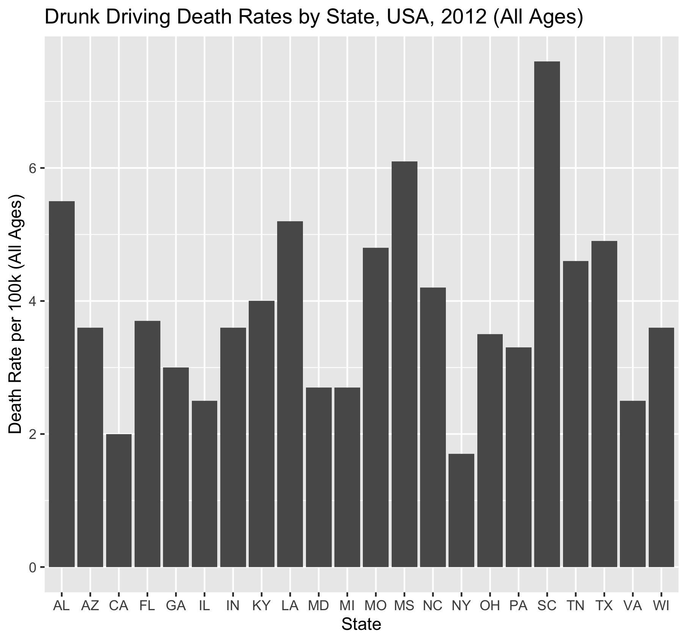

Figure \@ref(fig:resultfigure) plots Death Rates for People Killed in Crashes Involving a Driver with BAC =>0.08% by State, 2012 (All Ages)

```{r resultfigure,  fig.cap='Analysis figure.', echo=FALSE}

```


Figure \@ref(fig:resultfigure2) plots Death Rates for People Killed in Crashes Involving a Driver with BAC =>0.08% by State, 2012 (Age 0-20)

```{r resultfigure2,  fig.cap='Analysis figure.', echo=FALSE}

```


Figure \@ref(fig:resultfigure3) plots Death Rates for People Killed in Crashes Involving a Driver with BAC =>0.08% by State, 2012 (Age 21-34)

```{r resultfigure3,  fig.cap='Analysis figure.', echo=FALSE}

```


